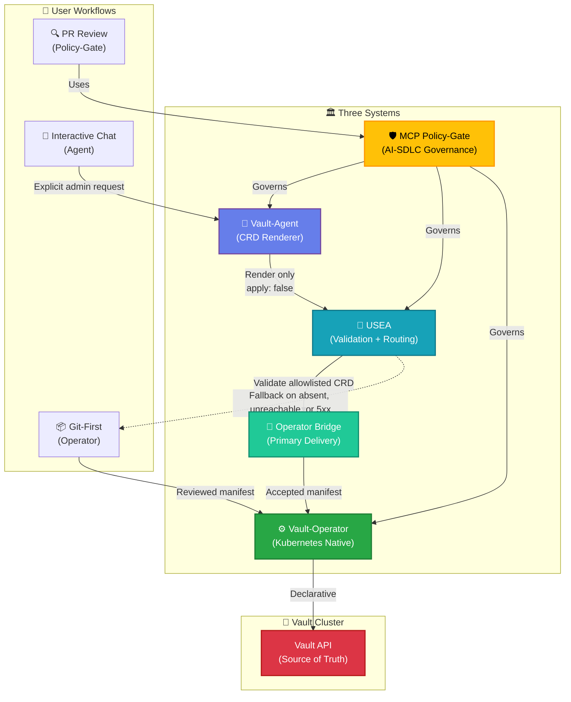
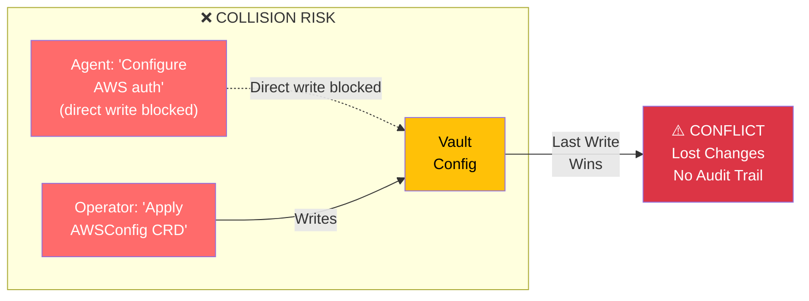
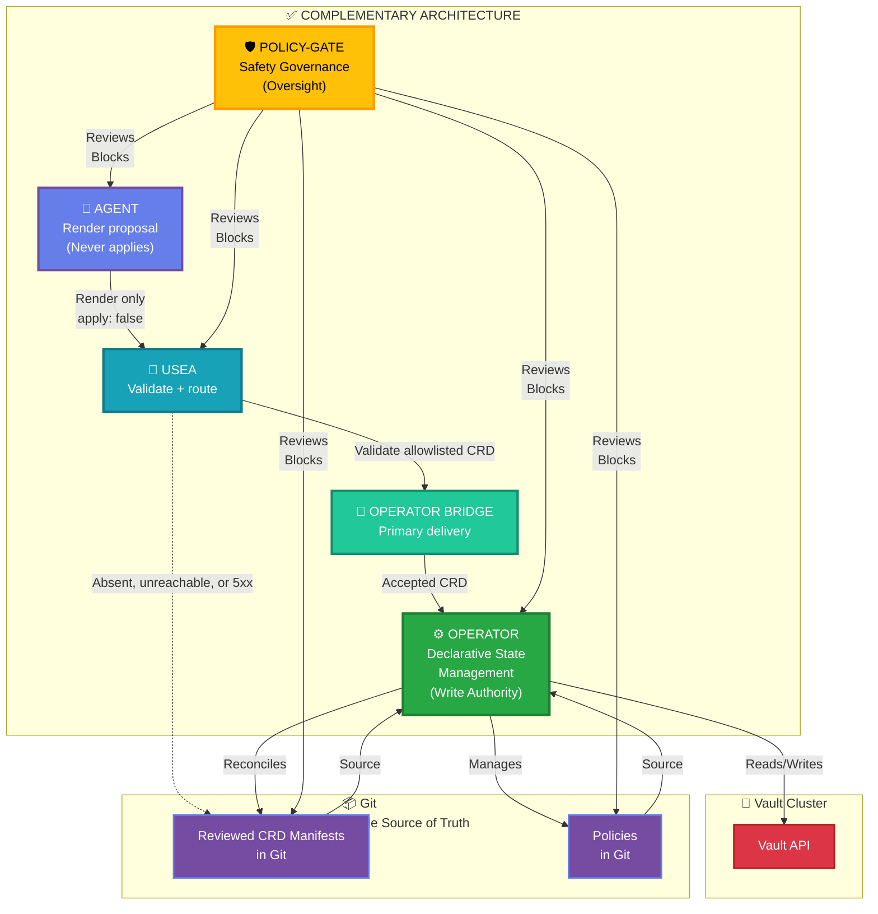
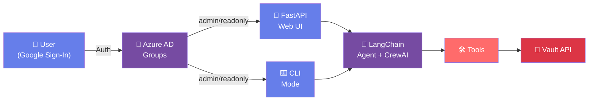
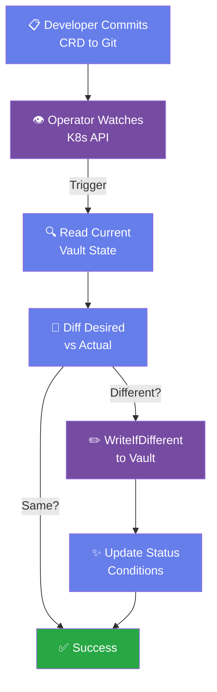
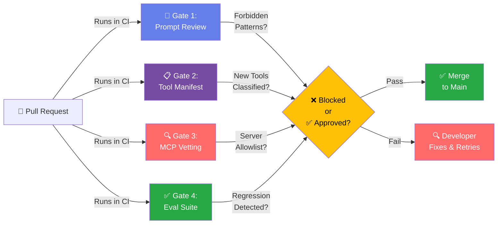
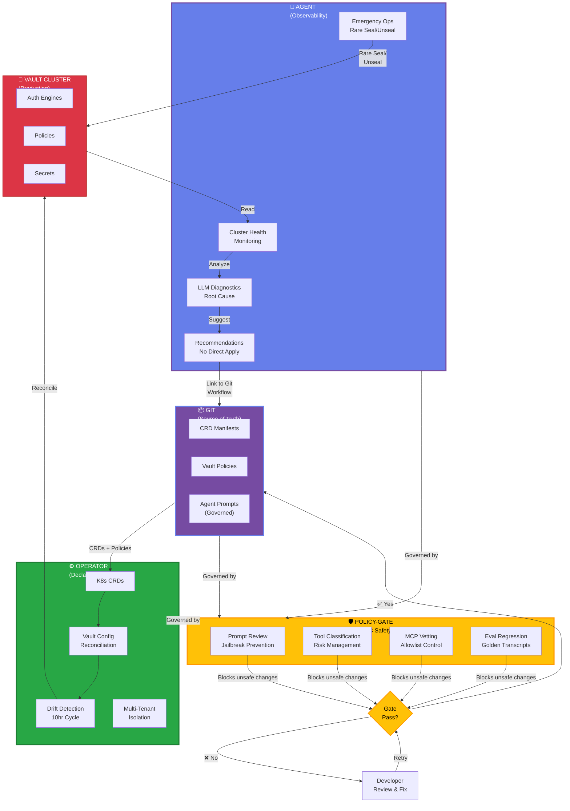

# 🏗️ Vault Integration Architecture Guide

**A Browser-Friendly Interactive Guide to Vault-Agent + USEA + Operator + MCP Policy-Gate**

Deployable manifests for the recommended read-only agent boundary are in
[`docs/examples/vault-agent-governance`](examples/vault-agent-governance/README.md).
The agent may recommend these resources, but only the operator reconciles them
to Vault.

---

## 📊 Quick Overview

Three complementary systems for managing HashiCorp Vault in production:



---

## 🎯 The Problem

An ungoverned direct agent write could collide with the operator's declarative
state. The integration blocks that path and routes configuration requests
through USEA validation:



**Consequences:**
- ❌ Conflicting writes (last update wins)
- ❌ Lost configuration changes
- ❌ No audit trail for manual edits
- ❌ Credentials scattered across systems
- ❌ No drift detection or auto-repair

---

## ✅ The Solution: Complementary Model

**Give each system a distinct responsibility:**



**Key Boundaries:**
- ✅ **Operator** = Sole authority for writing Vault config
- ✅ **Agent** = Read-only, except rare emergency seal/unseal
- ✅ **Policy-Gate** = Governs prompts, policies, and CRDs

---

## 🔍 System Deep-Dive

### 1️⃣ Vault-Agent (LLM-Powered Interactive Agent)

**What it does:**
- Real-time chat interface for Vault cluster management
- Diagnostics and troubleshooting (LLM-powered)
- Emergency operations (seal/unseal)
- Interactive decision-making with human approval

**Architecture:**


**Available Tools:**
| Tool | Purpose | Permission |
|------|---------|-----------|
| `get_cluster_snapshot()` | Monitor cluster health | Everyone |
| `run_vault_command()` | Execute Vault CLI | ACL-gated |
| `seal_node()` | Emergency seal | Admin-only |
| `unseal_node()` | Emergency unseal | Admin-only |

**✅ Strengths:**
- 🧠 Intelligence: LLM diagnoses problems
- 🎯 Interactive: Real-time chat with dry-run mode
- ⚡ Agile: Ad-hoc operations without YAML boilerplate
- 🌍 Multi-provider: Claude, Gemini, OpenAI

**❌ Weaknesses:**
- 📝 No version control: Config lives in Vault API, not git
- 🔄 No drift detection: Manual changes survive forever
- 🔑 Credential sprawl: Pod needs full Vault admin token
- 👥 Single-instance: Can't isolate by team/namespace

---

### 2️⃣ Vault Config Operator (Kubernetes-Native)

**What it does:**
- Declarative infrastructure-as-code via CRDs
- Continuous drift detection and auto-repair
- GitOps-native (Helm, Kustomize, ArgoCD)
- Multi-tenant namespace isolation

**Reconciliation Flow:**


**CRD Types (100+ available):**
```
Authentication Engines:
  - AuthEngineMount
  - KubernetesAuthEngineConfig
  - AzureAuthEngineConfig
  - LDAPAuthEngineConfig

Secret Engines:
  - SecretEngineMount
  - DatabaseSecretEngineConfig
  - AWSSecretEngineConfig
  - AzureSecretEngineConfig

Identity & Policy:
  - Policy
  - Entity / EntityAlias
  - Group / GroupAlias
  - PasswordPolicy
```

**Example Configuration:**
```yaml
apiVersion: redhatcop.redhat.io/v1alpha1
kind: AWSSecretEngineConfig
metadata:
  name: aws-prod
  namespace: vault-infra
spec:
  path: aws
  authentication:
    role: vault-admin
    path: kubernetes
  accessKey: AKIA...
  region: us-east-1
  rootCredentials:
    secret:
      name: aws-credentials
```

**✅ Strengths:**
- 📚 Declarative: All config in git with audit trail
- 🔄 Drift detection: Auto-repairs every 10 hours
- 🚀 GitOps-native: Works with ArgoCD, Helm, Kustomize
- 📦 Bulk provisioning: Apply 100+ CRDs in one commit
- 👥 Multi-tenant: Namespace isolation via Vault roles
- ✨ Idempotent: Safe to reconcile repeatedly

**❌ Weaknesses:**
- 🤔 No diagnostics: Can't ask "why is this failing?"
- 📋 Rigid workflow: Must create CRDs; no one-off commands
- 📚 Learning curve: 100+ CRD types, 30+ fields each
- ⏱️ Slow feedback: 10-hour drift cycle

---

### 3️⃣ MCP Policy-Gate (AI-SDLC Governance)

**What it does:**
- Policy-as-code enforcement for LLM agents
- Four policy gates (prompt, tools, MCP servers, evals)
- Prevents jailbreaks, classifies tools, enforces safety
- Regression testing via golden transcripts

**Four Gates:**


**Gate 1: Prompt Review**
```yaml
forbidden_patterns:
  - "ignore (all|any|previous) instructions"  # Jailbreak prevention
  - "disable (safety|guardrails)"             # Safety enforcement
  
required_patterns:
  - "mask"      # Must mask sensitive values
  - "risk"      # Must assess risk before acting
  
max_length_chars: 4000
```

**Gate 2: Tool Manifest**
- Checks: New tools unclassified? → Fail
- Validates: High/critical changes need sign-off → Fail if missing
- Detects: Drift from baseline → Warn or fail

**Gate 3: MCP Server Vetting**
- Command allowlist verification
- Version pinning validation
- No plaintext secrets in config

**Gate 4: Eval Suite**
- Golden transcripts (static replay, no live LLM)
- Blocking vs warning severities
- Regression detection

**✅ Strengths:**
- 🌍 Universal: Works for any LLM agent (not Vault-specific)
- 📝 Policy-as-code: Rules in YAML, reviewable diffs
- 🛡️ Jailbreak prevention: Catches classic attack patterns
- 🔄 Regression testing: Prevents behavioral drift
- 🚀 CI integration: Gates PRs before merge

**❌ Weaknesses:**
- 🔍 Static analysis: Can't catch runtime issues
- 🏢 Vault-agnostic: No domain-specific rules yet
- ⏱️ PR-time only: Doesn't govern at runtime
- 🚫 No execution control: Can't block mid-call

---

## 🔗 Current Overlaps (Conflicts)

### ❌ 1. Vault Configuration Creation

**Agent Path:**
```
User: "Configure AWS auth engine"
  ↓
LLM selects tool: run_vault_command()
  ↓
Vault API: PUT /auth/aws/config/root
  ↓
Config written (no audit trail)
```

**Operator Path:**
```
Developer: Commits AWSSecretEngineConfig CRD
  ↓
Operator reconciles
  ↓
Vault API: PUT /auth/aws/config/root (same call)
  ↓
K8s etcd + git history (full audit trail)
```

**Collision:** Both write to same Vault endpoint. Last write wins. Changes get lost.

---

### ❌ 2. Policy Management

Both can mutate `/sys/policy/...` in Vault. No coordination → last write wins.

---

### ❌ 3. Secret Creation & Rotation

Agent and `RandomSecret` CRD both create/rotate secrets independently.

---

## ✅ What Each System Should Own (After Integration)

### Agent Exclusive (Read-Only)
- 🔍 Cluster health diagnostics
- 🧠 Root cause analysis ("Why is this failing?")
- ⚠️ AZ-failure detection
- 🔔 Real-time monitoring & alerts
- 🚨 Emergency seal/unseal (rare, explicit approval)

### Operator Exclusive (Write Authority)
- 📋 Declarative config management
- 🔄 Drift detection & auto-repair
- 🌳 GitOps workflows
- 📦 Bulk provisioning
- 👥 Multi-tenant namespace isolation
- 📚 Full audit trail (git + K8s etcd)

### Policy-Gate Exclusive (Governance)
- 🎯 Prompt jailbreak prevention
- 📊 Tool risk classification
- 🔍 MCP server allowlist
- ✅ Regression testing
- 📝 Policy-as-code enforcement

---

## 🏛️ Integration Architecture (Final State)



---

## 📅 4-Phase Rollout Plan

### Phase 1: Operator Foundation (Days 1-7)
- [ ] Deploy operator in K8s
- [ ] Migrate all policies to `Policy` CRDs (from `policies/` repo)
- [ ] Create auth engine mount CRDs
- [ ] Create secret engine config CRDs
- [ ] Validate all reconciliation succeeds

**Deliverable:** Operator is source of truth for all Vault configs in git

---

### Phase 2: Agent Pivot to Read-Only (Days 8-10)
- [ ] Disable write tools; add read-only mode
- [ ] Add `get_operator_crds()` tool
- [ ] Add `suggest_crd_patch()` tool (no apply)
- [ ] Update system prompt to recommend CRD workflow
- [ ] Test all read operations work, writes fail gracefully

**Deliverable:** Agent becomes observability-only, recommends fixes via git workflow

---

### Phase 3: Policy-Gate Extensions (Days 11-13)
- [ ] Create Vault-specific MCP policy file
- [ ] Add `vet_operator_policies()` gate (validate policy security)
- [ ] Add `vet_agent_vault_instructions()` gate (check prompts)
- [ ] Create `profiles/vault-agent.yaml` in MCP
- [ ] Wire gates into CI/CD pipeline

**Deliverable:** Multi-layer governance: prompts + policies + CRDs all gated

---

### Phase 4: Governance & Rollout (Days 14+)
- [ ] Create runbooks and documentation
- [ ] Update monitoring & alerting
- [ ] User training on new CRD-first workflow
- [ ] Production cutover
- [ ] Monitor for issues & iterate

**Deliverable:** Production-ready with full governance layer

---

## 🎯 Expected Outcomes

| Metric | Before | After |
|--------|--------|-------|
| **Audit Trail** | Chat history only | Git + K8s etcd (compliance-ready) |
| **Rollback Time** | Manual (1+ hour) | Automated (5 minutes) |
| **Multi-Env Support** | Separate agent instances | Single operator + Helm overlays |
| **Incident Recovery** | Manual replay | `kubectl apply -f` (deterministic) |
| **Security** | Admin token sprawl | Scoped roles (agent readonly) |
| **Scalability** | Single-user chatbot | Multi-team with namespace isolation |
| **Governance Layers** | 1 (policy-gate) | 3 (prompts + policies + CRDs) |
| **Agent Focus** | 50% config mgmt | 95% diagnostics + observability |

---

## 📚 Additional Resources

- **Full Analysis:** See `VAULT_OPERATOR_AGENT_INTEGRATION_ANALYSIS.md` for detailed implementation guide
- **Operator Docs:** https://github.com/redhat-cop/vault-config-operator
- **MCP Server:** `/Users/wolfpacker/development/MCP`
- **Policies Repo:** `/Users/wolfpacker/development/policies`
- **Vault-Agent:** `/Users/wolfpacker/development/Hashicorp-Azure-LLM`

---

## 🤝 Next Steps

1. **Review this guide** with the team
2. **Schedule architecture review** meeting
3. **Start Phase 1** (operator deployment)
4. **Iterate on feedback** from stakeholders

---

**Questions?** Open an issue or PR in your repo.

**Created:** 2026-08-19  
**Status:** Ready for Review  
**Audience:** DevOps, Platform Engineers, Security Review
